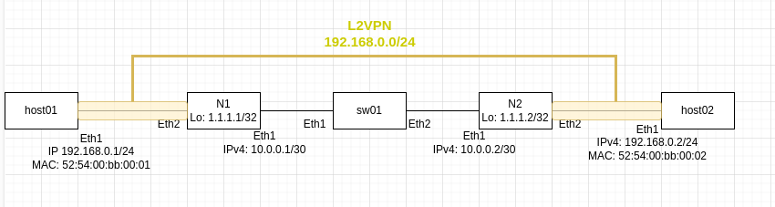

# Topology




# Containerlab install

[containerlab](https://containerlab.dev/install/)

``` 
$ sudo bash -c "$(curl -sL https://get.containerlab.dev)"
```

# Download this directory

``` 
$ git https://github.com/polaris700/evpn-vxlan_containerlab.git

$ cd evpn-vxlan_containerlab/l2vpn
```


# Usage

Containerlab ネットワークを作成

```
$ sudo containerlab deploy -t clab.yaml
```
